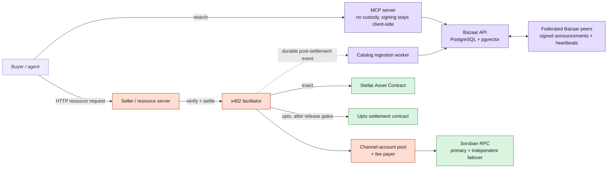
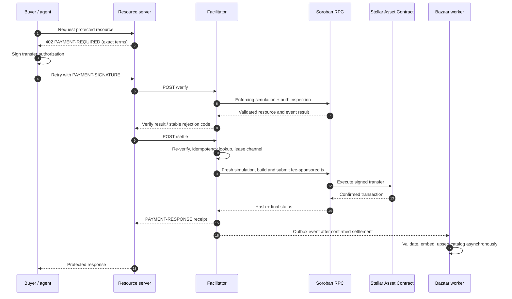
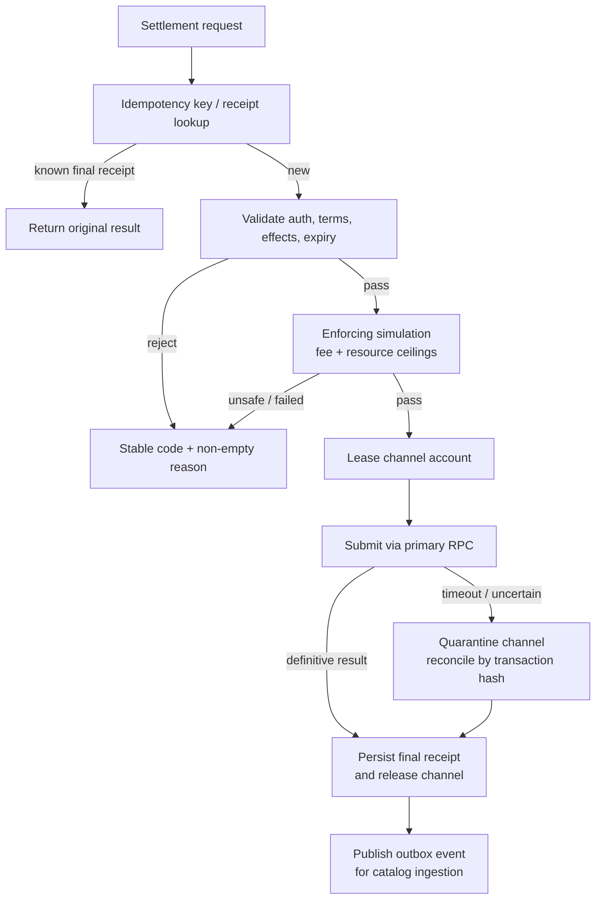
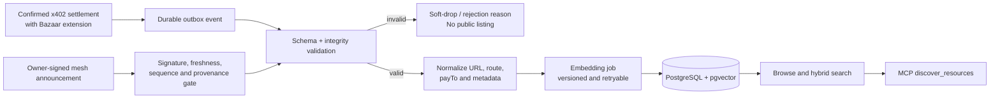
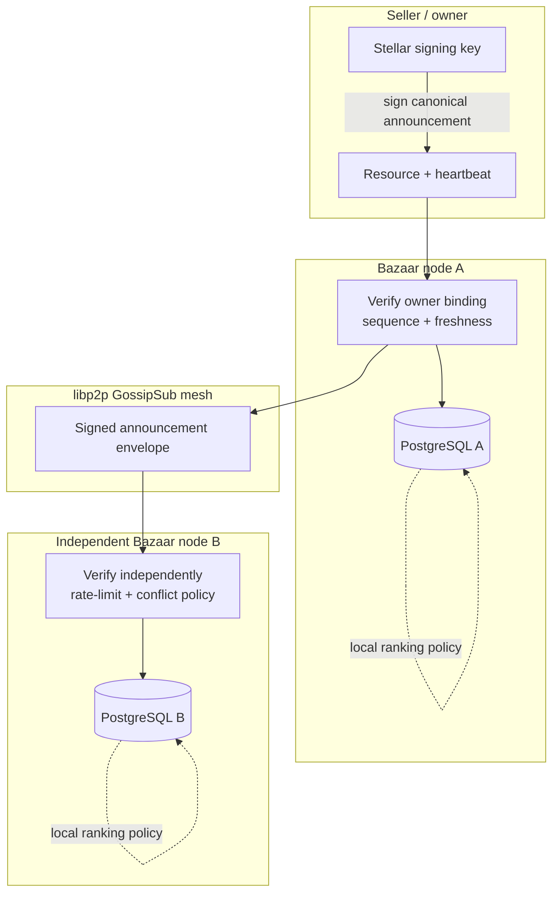
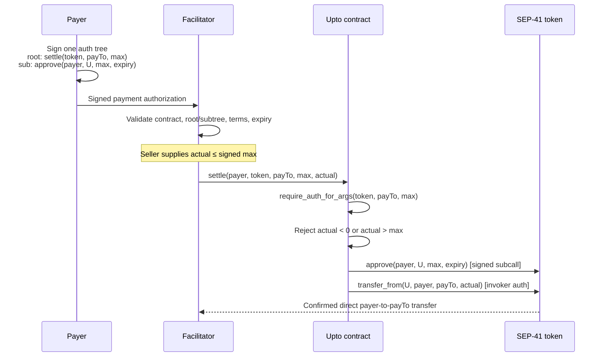

# Veridex Stellar x402 Facilitator and Federated Bazaar

**Architecture version:** 3.0-draft

**Last reviewed:** 2026-08-13

**Networks:** `stellar:testnet`, then `stellar:pubnet`

**License:** Apache-2.0

**Production catalog datastore:** PostgreSQL 16 + pgvector
**Architecture status:** target production architecture; deployment claims are separately evidenced below.

## 1. Executive summary

Veridex makes Stellar x402 useful to agents that do not already know a seller. It provides a standards-compatible payment facilitator, a PostgreSQL/pgvector Bazaar index, and an MCP client surface. Its distinguishing capability is a **federated discovery plane**: independently operated Bazaar nodes can exchange signed, freshness-bounded resource announcements while each operator retains control of its own PostgreSQL index and ranking policy.

The system is deliberately split into two planes:

- The **payment plane** verifies and settles exact payments. It is non-custodial: value moves from payer to `payTo`; the facilitator only supplies transaction submission and, when enabled, network-fee sponsorship.
- The **discovery plane** indexes payment-bound listings, measures service liveness, and makes ranked recommendations. Discovery is advisory. A malicious or stale listing can cause a failed request, but cannot alter a payment's signed recipient, asset, or amount.

`upto` is a planned second settlement scheme for metered usage. It must not be enabled on a public network until the contract and facilitator validator satisfy the design in section 7. The existing prototype signs the actual amount and uses persistent nonce storage; it is not the storage-less, single-signature `upto` design described here.

### 1.1 Evidence and delivery status

This distinction is intentional: it keeps the architecture persuasive without claiming deployment evidence that does not yet exist.

| Capability                                                   | Repository status                                             | Production / testnet claim                                                           |
| ------------------------------------------------------------ | ------------------------------------------------------------- | ------------------------------------------------------------------------------------ |
| Canonical`exact` facilitator surface                       | Implemented with`@x402/stellar` integration and local tests | Pending durable idempotency/outbox hardening and public testnet transaction evidence |
| PostgreSQL + pgvector catalog and hybrid search              | Implemented locally                                           | Pending operated testnet catalog evidence and durable post-settlement outbox         |
| Signed libp2p announcements, telemetry, and liveness scoring | Prototype implemented locally                                 | Pending full-envelope owner binding and multi-operator testnet exercise              |
| MCP discovery and paid-call path                             | Implemented locally                                           | Pending client-side signer isolation and end-to-end agent recording                  |
| Correct`upto` contract and auth-tree validator             | **Required redesign**                                   | Not deployable until the gates in section 7.6 pass                                   |

The public release checklist, deployed contract IDs/WASM hashes, testnet transaction hashes, conformance reports, and search-quality reports are release artifacts - not prose promises.

## 2. Decisions and non-negotiable invariants

| Decision                                                                 | Why it is the production choice                                                                                                                                                                          |
| ------------------------------------------------------------------------ | -------------------------------------------------------------------------------------------------------------------------------------------------------------------------------------------------------- |
| Build`exact` on `@x402/stellar`                                      | Keeps the wire format and core verification aligned with the canonical Stellar implementation instead of maintaining a fork of payment semantics.                                                        |
| PostgreSQL + pgvector in production                                      | Provides transactional catalog writes, audited telemetry, full-text retrieval, vector retrieval, repeatable migrations, and horizontal operational maturity. SQLite is not a production catalog backend. |
| Federate announcements, not settlement authority                         | Any node may discover and recommend resources; no node can redirect a signed payment or custody user funds.                                                                                              |
| Catalog only from successful settlement or a verified owner announcement | Prevents an unauthenticated client from creating a listing for somebody else's`payTo`.                                                                                                                 |
| Asynchronous catalog ingestion                                           | A PostgreSQL, embedding, or mesh outage must never turn a confirmed payment into a failed payment.                                                                                                       |
| Channel accounts for throughput                                          | Stellar sequence numbers serialize transactions per source account. Channel accounts provide parallel sources; fee bumps only separate fee funding and do not remove that serialization.                 |
| Enforcing simulation before payment acceptance                           | Recording-mode simulation does not validate the full authorization path or price resources safely.                                                                                                       |
| One permissive dependency path                                           | Apache-2.0/MIT/BSD-compatible dependencies only; CI must fail on copyleft or non-OSI production dependencies.                                                                                            |

The following invariants are release gates:

1. The facilitator never holds user value or appears in the payer's authorization tree.
2. A payment can settle only to the signed `payTo`, in the signed asset, and within the signed amount rule.
3. A discovery record is an advisory recommendation, never payment authorization.
4. All amount arithmetic is integer atomic units; there are no floating-point values on a payment path.
5. Retrying a request cannot create a second settlement.
6. Every rejection has a stable machine-readable code and a non-empty human-readable reason.
7. Service degradation fails closed for settlement safety and fails open only for non-critical discovery enrichment.

### 3. System at a glance



### 3.1 Trust boundaries

| Boundary        | Trusted for                                                   | Not trusted for                                  | Required control                                                                    |
| --------------- | ------------------------------------------------------------- | ------------------------------------------------ | ----------------------------------------------------------------------------------- |
| Buyer signer    | Signing payer intent                                          | Determining a seller's availability or quality   | Wallet / smart-account policy validates the complete signed authorization tree.     |
| Resource server | Delivering the paid resource and reporting usage              | Changing a signed asset, recipient, or cap       | Facilitator validates requirements and simulation independently.                    |
| Facilitator     | Correct validation, submission, fee sponsorship, and receipts | Custody or rerouting value                       | Does not appear in payer auth; transaction effect is checked before submission.     |
| Bazaar node     | Indexing and ranking recommendations                          | Payment authorization or ownership without proof | Listings are payment-bound or owner-signed; all listing data is advisory.           |
| Peer node       | Relaying signed announcements                                 | Making arbitrary listings authoritative          | Signature, freshness, sequence, provenance, rate, and conflict checks.              |
| RPC provider    | Simulation and transaction submission availability            | Acting as sole source of truth                   | Independent provider failover, response validation, and transaction reconciliation. |

## 4. Components and data ownership

| Component            | Responsibility                                                                  | Durable state                                                         | Failure behavior                                                    |
| -------------------- | ------------------------------------------------------------------------------- | --------------------------------------------------------------------- | ------------------------------------------------------------------- |
| Facilitator service  | `/supported`, `/verify`, `/settle`, transaction rebuilding and submission | Idempotency receipts, channel health, operational metrics             | Rejects unsafe/expired requests; never guesses a settlement result. |
| Channel-account pool | Leases sequence-number sources and reconciles uncertain submissions             | Operator-managed channel keys and per-channel state                   | Quarantines sequence-drifted accounts until reconciled.             |
| PostgreSQL Bazaar    | Catalog, search index metadata, telemetry, announcement audit trail             | PostgreSQL 16 + pgvector                                              | Search may degrade; settlement continues.                           |
| Embedding worker     | Generates and versions vector representations                                   | Embedding version and job status                                      | New listing remains browseable/text-searchable if embedding fails.  |
| P2P mesh             | Propagates signed owner/facilitator announcements                               | Ephemeral peer and replay cache; audit copies in PostgreSQL           | Mesh failure does not block local catalog or payment.               |
| MCP server           | Search and paid-call orchestration                                              | No payer signing key                                                  | Returns structured error; delegates signing to the client wallet.   |
| `upto` contract    | Enforces the variable settlement cap, recipient binding, and auth path          | No balance; only host-managed temporary authorization/allowance state | Scheme unavailable until independently verified and deployed.       |

### 4.1 Repository map

```text
facilitator-service/
  src/server.ts                 # canonical and legacy compatibility routes
  src/stellar/                  # x402 adapter, verifier, settler
  src/channel/                  # durable channel pool / leases

bazaar-service/
  src/db/schema.sql             # PostgreSQL + pgvector schema and indexes
  src/catalog/ingestion.ts      # validated post-settlement catalog ingestion
  src/search/                   # full text + vector + telemetry search
  src/p2p/                      # libp2p signed announcement mesh
  src/telemetry/                # heartbeat and liveness state

mcp-server/src/index.ts         # discover_resources and pay_resource tools
contracts/upto-settlement/      # prototype; replaced before scheme enablement
docs/openapi/                   # facilitator and Bazaar API contracts
```

## 5. Exact payment plane

`exact` is the first release scheme. The client signs a Soroban authorization for one SEP-41 transfer with a fixed integer amount. The facilitator verifies the challenge/response payload, re-simulates against a fresh ledger, submits a transaction using a leased source account, and returns a receipt.

### 5.1 Exact settlement sequence



### 5.2 Verification rules

The canonical verifier must reject the request unless all of these conditions hold:

- `x402Version` and the scheme/network agree with the payment requirements.
- The transaction has exactly the approved invocation shape and a single intended payment effect.
- The invoked asset contract, payer, recipient, and integer amount equal the requirements exactly.
- The facilitator is absent from the transaction source, operation source, transfer payer, and all payer authorization entries.
- Every required authorization is valid, fully signed, and ledger-bounded; unexpected pending signatures or invocations are rejected.
- Auth-entry expiry is within the configured maximum time window, allowing only a small ledger-estimation tolerance.
- Enforcing simulation succeeds within per-scheme resource and fee ceilings and emits exactly the expected transfer effect.
- Payer and recipient address forms, including muxed-address semantics where supported by the scheme, are normalized before comparison.

`/settle` repeats the security-critical checks against fresh ledger state. A prior `/verify` response is an optimization, not a settlement authority.

### 5.3 Throughput, idempotency, and uncertain outcomes



Channel accounts are sequence-number sources, not custodians. The production pool uses pre-provisioned, persistent operator keys. It is sized from the target settlement rate and observed ledger close time; it is not sized by a fixed marketing number. A fee-bump signer may pay the fee, but does not make a single source account concurrent.

The queue is bounded by remaining authorization validity, not only by queue length. If a request cannot be submitted before its auth expiry, it is rejected with a retryable code and `Retry-After`, before consuming channel capacity or sponsorship budget.

## 6. Bazaar discovery plane

### 6.1 PostgreSQL + pgvector production design

PostgreSQL is the source of truth for a local Bazaar node. `catalog_resources` holds the normalized, payment-bound resource metadata; `resource_telemetry` holds derived liveness and reliability observations; `node_heartbeats` provides an announcement audit trail. pgvector supplies semantic candidate retrieval and PostgreSQL full-text search supplies lexical retrieval.

Search uses a two-stage strategy:

1. Retrieve candidates using full-text/BM25-compatible ranking and pgvector cosine similarity, then fuse rankings with Reciprocal Rank Fusion.
2. Apply bounded, explainable quality factors: independently observed liveness, latency, successful settlement history, recency, metadata completeness, and anti-concentration penalties.

The result must return its `searchMethod`, `partialResults` state, opaque cursor, and a score-component explanation appropriate for an API client. Ranking is a recommendation and is never interpreted as identity proof or payment safety evidence.

### 6.2 Catalog lifecycle and integrity



The settlement-derived path is authoritative for a new listing: the recorded `payTo`, network, scheme, and resource reference originate from a successful payment. Announcements may refresh liveness and metadata only when their signer is cryptographically bound to the listing owner or a documented delegated operator. The database records provenance (`settlement`, `owner-announcement`, or `operator-reviewed`) and presentation must expose it.

Required validation includes JSON Schema validation, printable metadata limits, percent-decoding before route traversal checks, no URL scheme injection, SSRF-safe icon processing, same-document-only schema references, normalized URL keys, and per-owner insertion/update rate limits. All HTML/description fields are rendered as plain text by public catalog clients.

### 6.3 Federation without a walled garden



An announcement envelope must sign a canonical serialization of every security-relevant field - not just URL, timestamp, and sequence. The signed payload includes at least: protocol version, `nodeId`, owner/delegate identity, resource identifier, `payTo`, network, scheme, metadata digest, timestamp, expiry, and monotonically increasing sequence. Peers reject invalid signatures, timestamps outside the bounded clock-skew window, expired announcements, repeated or non-increasing sequences, and announcements that conflict with payment-bound ownership.

Peer identity is transport identity; listing authority is the Stellar owner/delegate signature. These must not be conflated. libp2p peer reputation and GossipSub scoring control transport abuse, while owner-level rate limits, stake/allowlist policy where appropriate, and query-time diversity caps limit Sybil-driven search manipulation.

### 6.4 Liveness and ranking safety

Heartbeat data is evidence about availability, not self-reported truth. A node records the signed heartbeat, uses direct probes where permitted, and calculates liveness over a rolling window. After one missed window a listing is degraded; after the configured maximum it is excluded from default results until a valid fresh observation arrives.

Ranking signals are bounded and decayed:

- text/vector relevance remains the dominant query-fit signal;
- settlement quality uses distinct-payer, time-decayed events where privacy policy permits, not raw volume alone;
- a provider cannot get an unlimited boost from its own domain or repeated self-pings;
- new listings receive a neutral cold-start prior rather than being silently buried;
- score weights, model/embedding version, and filtering rules are returned in the evaluation report;
- nDCG@10, MRR, Recall@20, coverage, and zero-result rate are regression-gated on a human-reviewed golden query set.

## 7. `upto`: metered settlement with one payer signature

### 7.1 Why a contract is required

An `exact` Soroban authorization commits to the transfer amount. A raw SEP-41 allowance can allow a variable amount, but by itself it does not bind a one-time payment to the intended recipient and leaves residual draw authority. The `upto` scheme therefore requires a narrowly scoped contract and a validator that understands its exact authorization tree.

The contract must never hold a user balance, have an administrative withdrawal path, or be upgradeable in place. New versions receive new contract addresses and a new explicitly advertised scheme configuration.

### 7.2 Correct authorization model

The payer authorizes only `(token, payTo, maxAmount)`. `actualAmount` is supplied at settlement and is checked on-chain to be an integer in `[0, maxAmount]`. The contract uses `require_auth_for_args` so the payer's signature does not commit to `actualAmount`.



The remaining allowance is bounded twice: it is usable only by the settlement contract, which cannot draw it without a new signer authorization, and it expires no later than the signed authorization. For `actualAmount == 0`, no sponsored transaction is submitted; the authorization is allowed to expire unused.

### 7.3 Required contract shape

The target contract has a single public settlement operation conceptually equivalent to:

```rust
pub fn settle(
    e: Env,
    payer: Address,
    token: Address,
    pay_to: Address,
    max: i128,
    actual: i128,
    live_until_ledger: u32,
) {
    payer.require_auth_for_args((token.clone(), pay_to.clone(), max).into_val(&e));
    if actual < 0 || actual > max {
        panic_with_error!(&e, Error::SettlementExceedsMax);
    }
    let token_client = token::TokenClient::new(&e, &token);
    token_client.approve(&payer, &e.current_contract_address(), &max, &live_until_ledger);
    token_client.transfer_from(&e.current_contract_address(), &payer, &pay_to, &actual);
}
```

This is illustrative, not deployable source. The production implementation requires audited error handling, exact Soroban SDK/XDR compatibility, and complete authorization-tree test vectors.

### 7.4 `upto` invariants and facilitator validation

| Required property               | Enforcement                                                                                                                    |
| ------------------------------- | ------------------------------------------------------------------------------------------------------------------------------ |
| Recipient binding               | `payTo` is an argument covered by `require_auth_for_args`; the validator matches it to requirements.                       |
| Maximum enforcement             | Contract rejects`actual > max`; the token allowance is also exactly `max`.                                                 |
| Single settlement authorization | The signed Soroban auth-entry nonce is consumed once by the host; no permanent contract nonce table is required.               |
| Time bound                      | Auth entry expiration and allowance`live_until_ledger` are checked, with `live_until_ledger <= signatureExpirationLedger`. |
| No escrow or residual custody   | Funds move payer-to-recipient through`transfer_from`; the settlement contract never receives a balance.                      |
| Sponsored-fee safety            | Zero settlement is not submitted; fee/resource ceilings and idempotency apply at both verify and settle.                       |

The facilitator must pin the operation target to its advertised `upto` contract address and reject routers, extra operations, an auth root that contains `actual`, unexpected sub-invocations, mismatched `max`, unbounded allowance expiry, or a signed invocation that does not match the payment requirements. It independently re-verifies the tree and `actual <= max` at settlement time.

### 7.5 Why transfer-and-refund and persistent nonce designs are rejected

Transferring the maximum into a contract and refunding the remainder introduces contract custody, per-asset authorization complications, clawback exposure, and a shared balance-storage hotspot. Persistent contract nonce storage is also unnecessary if the Soroban host consumes the signed auth-entry nonce; it creates rent/TTL work and obscures the actual replay authority.

The current prototype uses `require_auth()` over a call that includes `actual_amount`, and persistent nonce storage. It is retained only as a development reference and must be replaced before the `upto` route is advertised or deployed. This document supersedes any older prose that describes that prototype as production-ready.

### 7.6 Migration and release gates

1. Replace the prototype with the audited target design and remove admin/escrow functionality from the payment path.
2. Publish deterministic contract build instructions, WASM SHA-256, contract ID, compiler/SDK versions, and a source-to-WASM reproducibility check for each network.
3. Add facilitator auth-tree parsing/validation that pins every expected function, argument, and sub-invocation.
4. Pass unit, property, and integration tests covering partial/full/zero, over-cap, altered payee/token/max, replay, expiry, unexpected call shape, duplicate submission, and failed simulation.
5. Publish a testnet transaction set covering a single signed authorization used with multiple valid `actual` amounts in separate test authorizations, plus negative test evidence.
6. Complete independent security review and resolve all critical/high findings before pubnet enablement.

## 8. Reliability, security, and operations

### 8.1 Failure-domain policy

| Failure                      | Payment behavior                                        | Discovery behavior                                           | Operator action                                      |
| ---------------------------- | ------------------------------------------------------- | ------------------------------------------------------------ | ---------------------------------------------------- |
| PostgreSQL unavailable       | Exact settlement continues; outbox retains catalog work | Browse/search degraded or unavailable                        | Restore DB; replay idempotent outbox jobs.           |
| Embedding worker unavailable | Settlement continues                                    | New listing uses lexical/browse path and is backfilled later | Retry with versioned job.                            |
| Mesh unavailable             | Settlement and local catalog continue                   | Local index remains searchable; federation pauses            | Reconnect with bounded replay.                       |
| Primary RPC unavailable      | Fail over only after health and response checks         | No direct impact                                             | Reconcile submitted hashes; do not resubmit blindly. |
| Channel submission uncertain | Do not reuse the channel                                | No direct impact                                             | Quarantine, fetch status, then release/reset.        |
| Fee treasury below reserve   | Fail closed before sponsorship                          | No direct impact                                             | Alert and replenish under operator controls.         |

### 8.2 Threat-to-control matrix

| Threat                                     | Primary control                                                                                             | Test / alert                                    |
| ------------------------------------------ | ----------------------------------------------------------------------------------------------------------- | ----------------------------------------------- |
| Payment mutation or recipient substitution | Exact terms and`upto` args are signed; simulation effect check                                            | Altered asset/payee/amount test vectors         |
| Auth replay                                | Soroban host nonce; idempotency receipts; fresh re-verification                                             | Restart/retry/replay test                       |
| Sponsored-fee drain                        | Caller rate limits, prepaid/API-key policy for pubnet, fee and resource ceilings, zero-`upto` suppression | Failed-settlement fee-spend alarm               |
| Sequence collision                         | Leased channel sources and uncertain-outcome quarantine                                                     | Concurrent submission and timeout recovery test |
| Catalog spoofing                           | Successful-payment provenance or owner/delegate signature binding                                           | Attempt listing with another`payTo`           |
| SSRF / traversal metadata                  | URL, decoding, schema-reference, and rendering validation                                                   | Encoded traversal and private-address test      |
| Mesh replay / equivocation                 | Canonical signed payload, freshness, sequence, audit log, conflict rules                                    | Stale/repeated/conflicting announcement tests   |
| Search manipulation / Sybil boosting       | Bounded scores, diversity caps, distinct-payer/time-decay signals                                           | Ranking abuse regression set                    |
| RPC outage or dishonesty                   | Two providers, response validation, final-chain reconciliation                                              | Failover and disagreement drill                 |

### 8.3 Minimum production observability

The following metrics are mandatory and produce alerts with documented thresholds: verification/settlement success and latency; rejected requests by reason; sponsored fee spend and failed-settlement spend; auth expiry queue rejects; channel available/in-use/quarantined counts and sequence drift; RPC latency/error/disagreement; PostgreSQL health, ingestion lag, outbox age, embedding backlog; mesh peer count, invalid/replayed announcements; liveness-state changes; search latency, zero-result rate, and search quality regressions.

Logs are structured, correlated by request ID and transaction hash, and must never include secret keys, raw wallet material, or unnecessary customer payloads. Retention and access policy applies to telemetry; discovery data is not sold or shared.

## 9. API and developer experience

The facilitator exposes canonical x402 v2 routes:

- `GET /supported`
- `POST /verify`
- `POST /settle`

The Bazaar exposes:

- `GET /discovery/resources` - deterministic browse with `type`, `payTo`, `network`, `scheme`, extensions, limit, and cursor/offset compatibility.
- `GET /discovery/search` - hybrid natural-language search with structural filters, opaque cursor pagination, `partialResults`, `searchMethod`, provenance, and ranking explanation fields.

The MCP surface exposes `discover_resources` and `pay_resource`. It performs discovery and the HTTP 402 retry loop, but never holds a payer signing key. The wallet/smart-account signer remains client-side and applies its own allow-lists, budgets, approval rules, and spending policy to the complete authorization tree.

Seller helpers must validate discovery metadata before publication; buyer helpers must preflight recipient trustline/token readiness where possible before an authorization is spent. Error codes are shared across Bazaar, facilitator, MCP, and SDKs.

## 10. Verification and release evidence

| Layer                | Required evidence                                                                                                      |
| -------------------- | ---------------------------------------------------------------------------------------------------------------------- |
| Protocol conformance | Stock canonical x402 client completes`exact` payment on testnet and pubnet without modification.                     |
| Security             | Negative matrix for every verifier error;`upto` property/auth-tree tests; third-party review before pubnet `upto`. |
| Reliability          | Load test, channel sequence recovery test, RPC failover drill, retry/idempotency evidence.                             |
| Bazaar integrity     | Payment-bound listing test, owner-announcement signature tests, soft-drop/SSRF/traversal corpus.                       |
| Search               | Reproducible golden query set with Recall@20, nDCG@10, MRR, coverage, and regression gate.                             |
| Federation           | Two independently operated nodes exchange valid announcements and reject stale, replayed, and conflicting data.        |
| Operations           | Runbook, alerts tested on testnet, deployment addresses/WASM hashes, status page, incident response contacts.          |

No completion claim is made until the corresponding source, CI result, testnet/mainnet artifact, and runbook are published. That discipline - not a feature list - is what makes the system safe for agent payments and credible to ecosystem reviewers.
