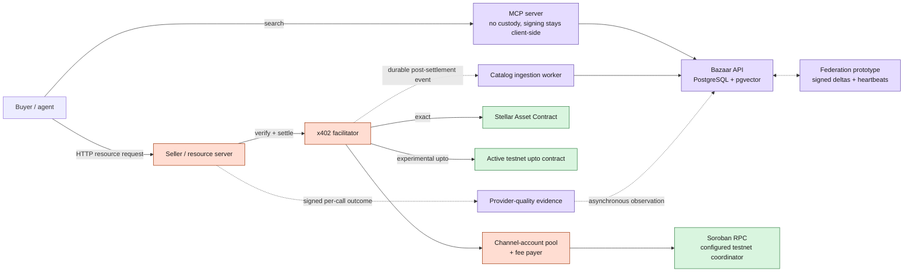
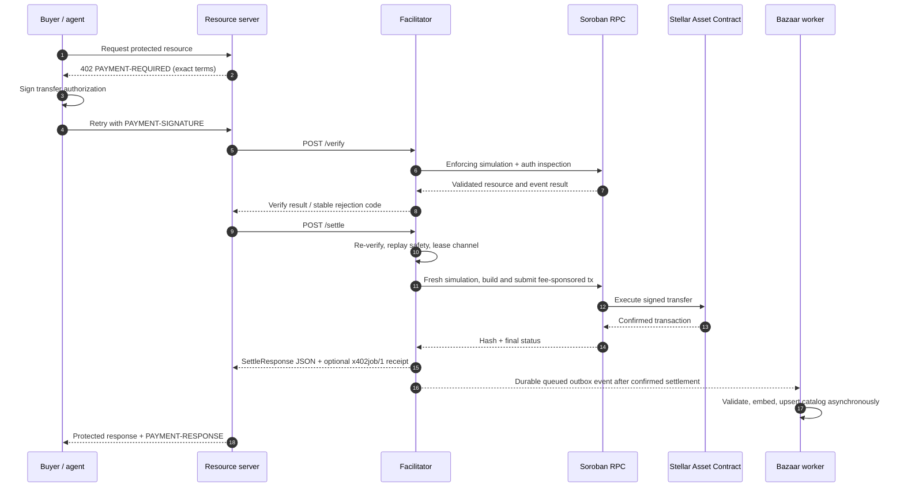
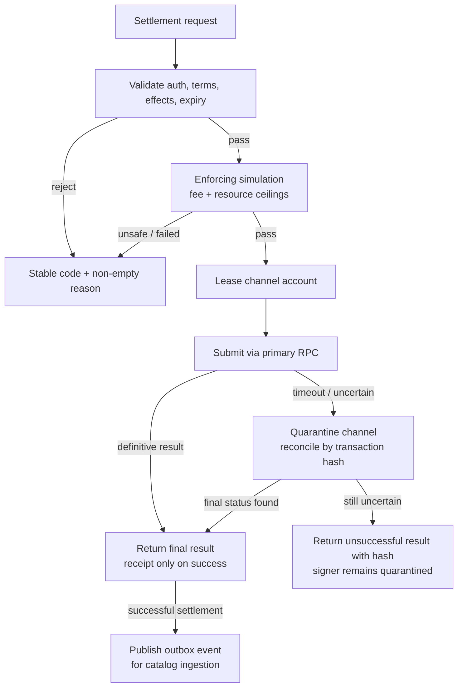
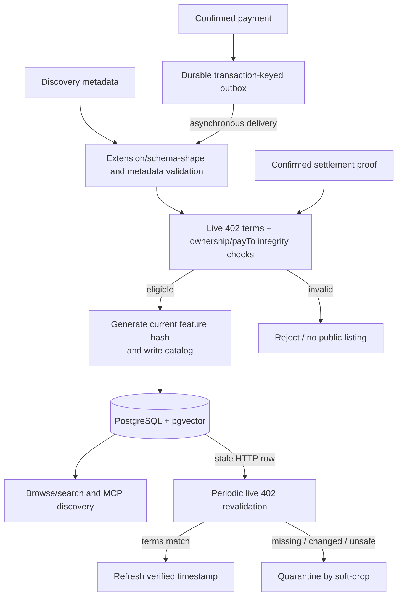
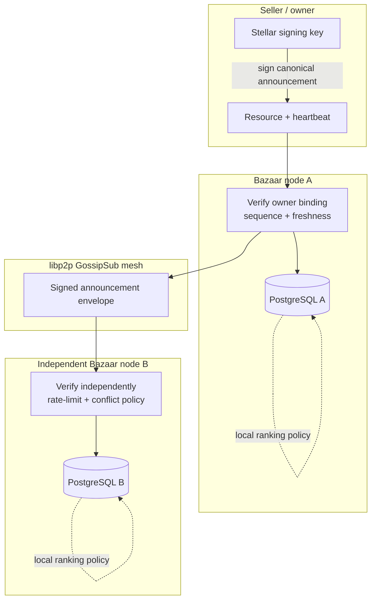
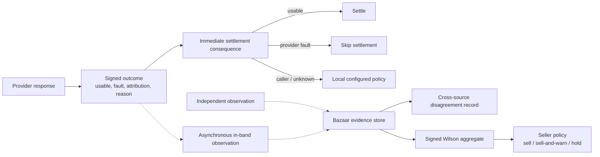

# Veridex Stellar x402 Facilitator and Federated Bazaar

**Architecture version:** 3.1

**Last reviewed:** 2026-09-06

**Status:** Current implementation + target production architecture

**Networks:** `stellar:testnet` is actively validated; `stellar:pubnet` is an approval-gated target. No pubnet or mainnet execution is part of the current evidence set.

**License:** Apache-2.0

**Production catalog datastore:** PostgreSQL 16 + pgvector

## 1. Executive summary

Veridex provides a standards-compatible Stellar x402 payment facilitator, PostgreSQL/pgvector Bazaar discovery, an MCP client surface, and a federated discovery design for agents that do not already know a seller. Independently operated Bazaar nodes can exchange signed, freshness-bounded resource announcements while each operator retains control of its own index and ranking policy.

The system deliberately separates three planes:

- The **payment plane** verifies and settles `exact` and experimental `upto` payments. It is non-custodial: value moves from payer to `payTo`; the facilitator supplies validation, transaction submission, and, when enabled, network-fee sponsorship.
- The **discovery plane** indexes payment-bound listings, measures service liveness, and makes ranked recommendations. Discovery is advisory. A malicious or stale listing can cause a failed request, but cannot alter a payment's signed recipient, asset, or amount.
- The **provider-quality plane** records per-call evidence, derives bounded aggregates, and informs seller policy. Provider evidence and reputation are policy signals, never payment authorization, and an external observatory is not a synchronous settlement dependency.

In short: **payment plane != discovery plane != provider-quality plane**. Signed payment authorization is the source of payment authority; a Bazaar listing is a recommendation; a provider observation is evidence; an aggregate reputation value is a policy signal.

`upto` is the second, experimental settlement scheme for metered usage. The active `upto-settlement` contract binds payer, recipient, token, ceiling, validity, facilitator, settlement id, and request/result evidence; it enforces `actual <= max` and contract-level replay protection. It is proven on Stellar testnet but remains unaudited and approval-gated for pubnet. The older `upto_escrow` prototype is not the advertised scheme.

## Implementation Status

The status vocabulary is evidence-sensitive and used consistently throughout this document:

| Status | Meaning |
|---|---|
| `TESTNET PROVEN` | Executed on `stellar:testnet` with a recorded transaction, integration path, or clean-stack artifact. |
| `IMPLEMENTED` | Present in the active runtime and covered by repository tests, without a broader live-proof claim. |
| `IMPLEMENTED BUT NOT FULLY PROVEN` | Implemented and tested, with an important deployment, failure, scale, or independence proof still open. |
| `PROTOTYPE` | Working local behavior whose operating model or durability is not production-established. |
| `TARGET PRODUCTION` | Intended production behavior that is not the current runtime capability. |
| `DEFERRED` | Deliberately postponed pending upstream support, external infrastructure, or a later tranche. |
| `NOT IMPLEMENTED` | No active runtime implementation exists. |

### TESTNET PROVEN

- Stock-client `exact`: 402 challenge, payer authorization, verification, settlement, signed receipt, and protected response.
- Direct `upto` partial and zero settlement, replay rejection, and the custom HTTP `upto` seller/client path.
- Bazaar automatic cataloging, settlement/resource binding, persistence, browse/search discovery, and restart survival for the captured clean-room stack.
- Keyless MCP discovery and paid calls with client-side signing.
- Fresh-account/empty-volume bootstrap applying all six migrations, followed by `36/36` conformance and settlement-backed discovery.

### IMPLEMENTED

- Stable cross-service errors, live 402 catalog-term validation, periodic catalog revalidation, provider-quality source/disagreement persistence, metrics endpoints, and seller policy modes.
- Durable single-host catalog outbox retention/replay and authenticated channel-signer recovery.

### IMPLEMENTED BUT NOT FULLY PROVEN

- Channel leasing/quarantine: exercised by unit/integration tests and a `10/25/50/100` testnet load smoke, but not by a real ambiguous-submission recovery drill or multi-instance deployment.
- RPC failover/reconciliation: exercised by deterministic tests and a live loopback testnet drill, but not by independently operated providers or pubnet.
- Catalog revalidation: implemented and package-tested; all migrations are clean-stack proven, but a timed live periodic revalidation/quarantine drill remains open.
- Provider-quality aggregation and observability: active and tested, without a representative independent-observer corpus, external monitoring stack, or alert-routing proof.

### PROTOTYPE

- Signed libp2p federation has a local in-process three-node lifecycle proof; multi-process restart persistence and multi-operator operation are not proven.

### TARGET PRODUCTION

- HA PostgreSQL/outbox operation, an independent embedding worker, durable federation replay state, production monitoring/alerts, backup/restore, TLS/edge controls, and independently operated RPC/federation infrastructure.

### DEFERRED

- Stock upstream `@x402/stellar` support for `upto`, npm publication of the Veridex Stellar SDK, and pubnet enablement.

### NOT IMPLEMENTED

- A deployed smart-account/stablecoin budget fixture that proves policy through the signed `__check_auth` path.

### Approval-Gated Scope

Pubnet/mainnet transactions, production fee sponsorship, production `upto`, and production-readiness claims require explicit approval. Independent security review is a release gate, not current evidence.

### Evidence and delivery status

This distinction is intentional: it keeps the architecture persuasive without claiming deployment evidence that does not yet exist.

| Capability | Status | Evidence | Boundary |
|---|---|---|---|
| Canonical `exact` facilitator | `TESTNET PROVEN` | Stock-client `36/36`, ledger settlement, receipt recomputation | Pubnet and external audit are approval gates |
| Active custom `upto` | `TESTNET PROVEN` | Direct partial/zero/replay plus custom HTTP path | Experimental, unaudited, not stock upstream interoperability |
| Bazaar catalog/discovery | `TESTNET PROVEN` | Automatic cataloging, six-migration clean bootstrap, settlement binding, browse/search, captured restart persistence | Timed live periodic revalidation remains package-tested only |
| Durable catalog outbox | `IMPLEMENTED` | Unavailable-Bazaar retention/restart/replay test | Single-host file spool, not HA/shared queue |
| Search regression | `IMPLEMENTED` | 10 documents, 50 reviewed queries, committed metrics | Lexical feature hashing, not semantic; latency is in-memory |
| Channel leasing/quarantine | `IMPLEMENTED BUT NOT FULLY PROVEN` | Scheduler tests and testnet saturation smoke | Process-local state; real ambiguity drill pending |
| RPC failover/reconciliation | `IMPLEMENTED BUT NOT FULLY PROVEN` | Coordinator tests and live loopback drill | Independent operators and pubnet pending |
| Provider-quality plane | `IMPLEMENTED BUT NOT FULLY PROVEN` | Signed outcomes, source/disagreement persistence, Wilson aggregates, seller policy tests | Representative independent corpus/public service pending |
| Federation | `PROTOTYPE` | Local in-process three-node signed lifecycle | Multi-process persistence and multi-operator proof pending |
| Keyless MCP | `TESTNET PROVEN` | `discover_resources`, exact `pay_resource`, client-side signing, recorded ledgers | `upto` MCP execution and broad client interoperability pending |

The public release checklist, deployed contract IDs/WASM hashes, testnet transaction hashes, conformance reports, and search-quality reports are release artifacts - not prose promises.

## 2. Decisions and non-negotiable invariants

| Decision                                                                 | Why it is the production choice                                                                                                                                                                          |
| ------------------------------------------------------------------------ | -------------------------------------------------------------------------------------------------------------------------------------------------------------------------------------------------------- |
| Build `exact` on `@x402/stellar`                                      | Keeps the wire format and core verification aligned with the canonical Stellar implementation instead of maintaining a fork of payment semantics.                                                        |
| PostgreSQL + pgvector in production                                      | Provides transactional catalog writes, queryable telemetry, full-text retrieval, vector retrieval, repeatable migrations, and horizontal operational maturity. SQLite is not a production catalog backend. |
| Federate announcements, not settlement authority                         | Any node may discover and recommend resources; no node can redirect a signed payment or custody user funds.                                                                                              |
| Catalog admission requires successful settlement proof | A signed owner/delegate update may change authorized metadata, but it does not bypass settlement verification or live payment-term checks. |
| Asynchronous catalog ingestion                                           | A PostgreSQL, embedding, or mesh outage must never turn a confirmed payment into a failed payment.                                                                                                       |
| Channel accounts for throughput                                          | Stellar sequence numbers serialize transactions per source account. Channel accounts provide parallel sources; fee bumps only separate fee funding and do not remove that serialization.                 |
| Enforcing simulation before payment acceptance                           | Recording-mode simulation does not validate the full authorization path or price resources safely.                                                                                                       |
| License policy is explicit and gated                                     | CI checks every npm lockfile; reviewed optional Playground `sharp`/`libvips` exceptions remain visible and require distribution review. |

The following invariants are release gates:

1. The facilitator never holds user value or appears in the payer's authorization tree.
2. A payment can settle only to the signed `payTo`, in the signed asset, and within the signed amount rule.
3. A discovery record is an advisory recommendation, never payment authorization.
4. All amount arithmetic is integer atomic units; there are no floating-point values on a payment path.
5. Retrying a request cannot create a second settlement.
6. Every rejection has a stable machine-readable code and a non-empty human-readable reason.
7. Service degradation fails closed for settlement safety and fails open only for non-critical discovery enrichment.

## 3. Current Testnet Architecture

This is the architecture that exists now. Dashed arrows are asynchronous and are not part of the payment success decision.



### 3.1 Public and internal trust boundaries

| Boundary        | Trusted for                                                   | Not trusted for                                  | Required control                                                                    |
| --------------- | ------------------------------------------------------------- | ------------------------------------------------ | ----------------------------------------------------------------------------------- |
| Buyer signer    | Signing payer intent                                          | Determining a seller's availability or quality   | Wallet / smart-account policy validates the complete signed authorization tree.     |
| Resource server | Delivering the paid resource and reporting usage              | Changing a signed asset, recipient, or cap       | Facilitator validates requirements and simulation independently.                    |
| Facilitator     | Correct validation, submission, fee sponsorship, and receipts | Custody or rerouting value                       | Does not appear in payer auth; transaction effect is checked before submission.     |
| Bazaar node     | Indexing and ranking recommendations                          | Payment authorization or ownership without settlement proof | Listings remain payment-bound and advisory. |
| Provider observatory | Producing signed evidence and aggregates | Authorizing payment or becoming a synchronous settlement dependency | Seller policy verifies aggregate binding/freshness and defines outage behavior. |
| Peer node       | Relaying signed announcements                                 | Making arbitrary listings authoritative          | Owner/delegate signatures, freshness, sequence, and conflict checks; peer ID is transport only. |
| RPC provider    | Simulation and transaction submission availability            | Acting as sole source of final truth              | Exactly-one submission, local hash computation, and cross-provider status reconciliation. |

## 4. Components and data ownership

| Component            | Responsibility                                                                  | Durable state                                                         | Failure behavior                                                    |
| -------------------- | ------------------------------------------------------------------------------- | --------------------------------------------------------------------- | ------------------------------------------------------------------- |
| Facilitator service  | `/supported`, `/verify`, `/settle`, transaction rebuilding and submission | Durable catalog outbox; process-local receipt responses, channel state, and metrics | Rejects unsafe/expired requests; never guesses a settlement result. |
| Channel-account pool | Leases sequence-number sources and quarantines uncertain submissions | Operator-managed channel keys; process-local lease/quarantine state | Requires authenticated explicit recovery after reconciliation. |
| PostgreSQL Bazaar    | Catalog, search index metadata, telemetry, announcement audit trail             | PostgreSQL 16 + pgvector                                              | Search may degrade; settlement continues.                           |
| Embedding worker     | Target production component for versioned learned representations | Not implemented as an independent durable worker | Current ingestion uses synchronous feature hashing with fallback; settlement remains independent. |
| P2P mesh             | Propagates signed owner/facilitator announcements                               | Ephemeral peer and replay cache; audit copies in PostgreSQL           | Mesh failure does not block local catalog or payment.               |
| MCP server           | Search and exact challenge preparation/externally signed paid-call submission | No payer signing key | Returns structured errors/data and delegates signing/policy to the client wallet. |
| `upto` contract | Enforces variable cap, recipient/token/facilitator binding, validity, and replay | Settlement ids and consumed-authorization state; never a user balance | Testnet-only until independent audit and pubnet approval. |

### 4.1 Repository map

```text
facilitator-service/
  src/server.ts                 # canonical and legacy compatibility routes
  src/stellar/                  # x402 adapter, verifier, settler
    src/settle-scheduler.ts       # process-local signer leasing and quarantine
    src/catalog-outbox.ts         # durable single-host post-settlement queue

bazaar-service/
  src/db/schema.sql             # PostgreSQL + pgvector schema and indexes
  src/catalog/ingestion.ts      # validated post-settlement catalog ingestion
  src/search/                   # full text + vector + telemetry search
  src/p2p/                      # libp2p signed announcement mesh
  src/telemetry/                # heartbeat and liveness state

mcp-server/src/index.ts         # discover_resources and pay_resource tools
contracts/upto-settlement/      # active experimental testnet contract
contracts/upto_escrow/          # obsolete development prototype, not advertised
docs/openapi/                   # facilitator and Bazaar API contracts
sdk-typescript/                 # focused @veridex/stellar buyer/Bazaar/facilitator facade
```

## 5. Target Production Architecture

The production target extends the current architecture without moving discovery or provider quality into the payment critical path.

| Area | Target state | Release evidence required |
|---|---|---|
| Network | Approval-gated `stellar:pubnet` alongside testnet | Pubnet transaction set, explicit approval, audited contract/build artifacts |
| Settlement durability | Durable receipt/idempotency records and multi-instance channel ownership | Duplicate/restart tests and ambiguous-submission recovery across instances |
| Data plane | HA PostgreSQL, backup/restore, shared durable outbox | Failover and restore drills with measured recovery objectives |
| Embeddings | Independent versioned worker with retry/backfill and lexical-first publication | Worker outage/recovery and migration evidence |
| RPC | Independently operated TLS providers with reconciliation policy | Provider-failure, disagreement, and latency drills |
| Federation | Multi-process, multi-operator nodes with durable replay state | Restart/persistence, authority, equivocation, and abuse tests |
| Observability | External collection, retention, dashboards, alert routing, and tested runbooks | Alert and incident-response exercises |
| Security | Independent review of exact integration, custom `upto`, and cross-service controls | Published review disposition with critical/high findings resolved |
| Agent policy | Deployed smart-account/stablecoin policy enforced through signed authorization | Testnet `$10/$2/$12` signed-path fixture before any pubnet claim |

## 6. Exact payment plane

**Status: `TESTNET PROVEN`.** `exact` is the canonical release scheme. The client signs a Soroban authorization for one SEP-41 transfer with a fixed integer amount. The facilitator verifies the challenge/response payload, re-simulates against fresh ledger state, submits a transaction using a leased source account, and returns a signed `x402job/1` receipt.

The recorded flow is 402 -> payment authorization -> verification -> settlement -> receipt -> protected response. The authoritative transaction and ledger evidence is maintained in the [testnet conformance report](rfp/testnet-conformance-report.md) and [acceptance matrix](rfp/testnet-acceptance-matrix.md), rather than duplicated here. The latest committed conformance artifact records `36/36` checks using the stock `@x402/stellar@2.21.0` client path. No private credential is part of the evidence artifact.

### 6.1 Exact settlement sequence



### 6.2 Verification rules

The canonical verifier must reject the request unless all of these conditions hold:

- `x402Version` and the scheme/network agree with the payment requirements.
- The transaction has exactly the approved invocation shape and a single intended payment effect.
- The invoked asset contract, payer, recipient, and integer amount equal the requirements exactly.
- The facilitator is absent from the transaction source, operation source, transfer payer, and all payer authorization entries.
- Every required authorization is valid, fully signed, and ledger-bounded; unexpected pending signatures or invocations are rejected.
- Auth-entry expiry is within the configured maximum time window, allowing only a small ledger-estimation tolerance.
- Enforcing simulation succeeds within per-scheme resource and fee ceilings and emits exactly the expected transfer effect.
- Payer and recipient address forms, including muxed-address semantics where supported by the scheme, are normalized before comparison.

`/settle` repeats the security-critical checks against fresh ledger state. A prior `/verify` response is an optimization, not a settlement authority.

### 6.3 Throughput, idempotency, and uncertain outcomes



Channel accounts are sequence-number sources, not custodians. The production pool uses pre-provisioned, persistent operator keys. It is sized from the target settlement rate and observed ledger close time; it is not sized by a fixed marketing number. A fee-bump signer may pay the fee, but does not make a single source account concurrent.

The current queue is bounded by a configured timeout and signer count. Saturation is rejected with `settlement_capacity_exceeded`, `Retry-After`, and an explicit no-funds-moved message. Authorization replay protection prevents a successful authorization from settling twice, but a durable receipt/idempotency store that returns a prior response by request key is `NOT IMPLEMENTED`. Binding queue admission directly to remaining authorization validity remains `TARGET PRODUCTION`.

The committed `10/25/50/100` testnet load smoke prepared payment payloads sequentially and timed settlement concurrency. Across 185 requests, 32 were ledger-confirmed, 90 were rejected at scheduler capacity, 63 failed simulation, and no retries or sequence errors were recorded. This is saturation evidence for the configured three-signer pool, not a production throughput benchmark or representative activity corpus.

### 6.4 Channel-account status

**Status: `IMPLEMENTED BUT NOT FULLY PROVEN`.** Pre-funded channel accounts provide parallel transaction sources. The scheduler leases one source per in-flight settlement, bounds wait time, exposes available/in-use/quarantined gauges, and quarantines the exact leased signer when an uncertain result carries a transaction hash. Recovery requires an authenticated explicit action after operator reconciliation.

Keys are operator-managed and persistent, but lease, queue, and quarantine state are process-local. Multi-instance key partitioning, durable quarantine state, and a real ambiguous-submission/recovery drill remain `TARGET PRODUCTION` evidence gaps.

### 6.5 RPC failover status

**Status: `IMPLEMENTED BUT NOT FULLY PROVEN`.** When at least two RPC URLs are configured on testnet, a local coordinator tracks endpoint health, fails over reads and pre-submit health checks, submits an envelope to exactly one provider, computes its transaction hash locally, and reconciles transaction status across configured providers after an ambiguous response. Conflicting final statuses fail safely and increment a disagreement metric.

Six focused tests cover normal operation, pre-submit failover, ambiguous timeout, unresolved hash, and disagreement. A live loopback testnet drill recorded seven failovers and five primary failures while payment succeeded. Because those endpoints were exercised through the local coordinator rather than independently operated infrastructure, independent-provider and pubnet maturity are not claimed.

## 7. Bazaar discovery plane

### 7.1 Current catalog and retrieval implementation

**Status: `TESTNET PROVEN` for a six-migration empty-volume bootstrap, settlement-backed cataloging, persistence, browse/search, and captured restart survival; `IMPLEMENTED BUT NOT FULLY PROVEN` for timed periodic revalidation.** PostgreSQL is the source of truth for a local Bazaar node. `catalog_resources` holds normalized payment-bound resource metadata, `resource_telemetry` holds liveness and settlement counters, and provider observation/aggregate tables hold provider-quality evidence.

Current search uses two lexical retrieval legs:

1. PostgreSQL full-text matching ranked with `ts_rank_cd`.
2. A 384-dimensional deterministic feature-hash vector ranked by pgvector cosine distance. Feature hashing uses token unigrams/bigrams; it is lexical, not a learned semantic embedding. The current SQL also requires lexical overlap for this vector candidate leg.

The two ranks are fused with Reciprocal Rank Fusion. The result is then boundedly modulated by uptime, response latency, raw settlement-count reliability, and liveness state. Current responses expose the opaque continuation cursor, `partialResults`/reason state, and component score fields. They do not expose a `searchMethod` or catalog provenance field; those are `TARGET PRODUCTION`. Ranking is a recommendation and is never identity proof or payment safety evidence.

### 7.2 Catalog lifecycle and integrity



For a new paid resource, discovery metadata passes bounded validation, live HTTP resources must return matching 402 terms, and a real settlement must confirm the advertised `payTo`. One transaction can bind only one catalog entry, and an existing URL/tool key cannot be reassigned to a different payee. A confirmed payment is queued to a transaction-keyed atomic file-spool outbox; ingestion and search indexing occur asynchronously, so Bazaar failure does not change settlement success.

Existing HTTP rows are selected after their verification timestamp becomes stale. Revalidation re-fetches the live 402 challenge: matching terms refresh the row, while missing, changed, or unsafe terms set a stable reason and soft-drop the row from search. This lifecycle is implemented and package-tested; all six migrations now have a fresh empty-volume application artifact, while a timed live revalidation/quarantine drill remains open.

Signed owner/delegate catalog deltas are validated for authority, ordering, and conflict behavior, but they do not independently bypass settlement proof for catalog admission. Transport peer identity is not listing authority. Persisted/exposed provenance classes and operator-reviewed admission are `NOT IMPLEMENTED` in the current response model.

Current metadata controls include bounded schemas/field sizes, route-template and decoded traversal checks, URL/scheme restrictions, same-document schema-reference restrictions, live-term URL safety, normalized resource keys, internal ingestion authentication, and global request/body rate limits. Per-owner catalog rate limits and a complete icon-fetch pipeline are `TARGET PRODUCTION`. Public clients must continue rendering seller-controlled text as untrusted plain data.

### 7.3 Search benchmark

**Status: `IMPLEMENTED`.** The committed [search evaluation artifact](rfp/search-evaluation-2026-09-06.json) compares a lexical baseline with the current feature-hash-plus-lexical RRF runner.

| Field | Current evidence |
|---|---|
| Dataset | 10 hand-authored resource documents |
| Queries | 50 reviewed queries across exact, paraphrase, zero-overlap, ambiguous, no-result, MCP, and filtered categories |
| Labels | Graded relevance: `3` perfect, `2` highly relevant, `1` marginal, `0` irrelevant; no-result queries have empty qrels |
| Procedure | Apply declared filters, rank the same in-memory corpus with lexical-only and lexical feature-hash/RRF, then macro-average judged queries |
| Recall@1 | Baseline/current `0.6489` / `0.6489` |
| Recall@5 | Baseline/current `0.8546` / `0.8546` |
| Recall@20 | Baseline/current `0.8546` / `0.8546` |
| nDCG@5 | Baseline/current `0.8589` / `0.8633` |
| nDCG@10 | Baseline/current `0.8589` / `0.8633` |
| MRR | Baseline/current `0.8766` / `0.8794` |
| Coverage | Baseline/current `0.8936` / `0.8936` |
| Zero-result rate | Baseline/current `0.16` / `0.16`; no-result accuracy is `1.0` |
| p95 latency | Baseline/current `0.035 ms` / `1.696 ms` in the in-memory evaluator |

Recall@k is the fraction of judged-relevant documents present in the top `k`; nDCG@k is graded discounted gain normalized by the ideal ordering; MRR is the reciprocal rank of the first relevant result; coverage is the fraction of judged non-empty queries with at least one result; zero-result rate is the fraction of all queries returning no rows; p95 is the 95th-percentile measured ranking-call latency. The benchmark is a regression set, not a production traffic corpus. Its latency excludes PostgreSQL/network time, and the zero-lexical-overlap paraphrase remains a known miss. No semantic-search claim is made.

### 7.4 Federation without a walled garden

**Status: `PROTOTYPE`.** Signed catalog deltas, owner/delegate authorization, revision/digest ordering, replay/conflict rules, and revoke/restore behavior are implemented. A local in-process three-node libp2p test demonstrates A/B/C transport and deterministic convergence. Multi-process restart/persistence and multi-operator operation are not proven.



Catalog deltas sign a canonical serialization of resource URL, network, scheme, `payTo`, revision, operation, metadata digest, issued/expiry times, and signer. Peers reject invalid or unauthorized signatures, excessive lifetimes, stale/future messages, and lower-priority revision/digest conflicts. Heartbeat v2 signatures cover the full canonical announcement, but the runtime still accepts the legacy `resourceUrl:timestamp:sequence` heartbeat signature for compatibility. Removing that fallback is a `TARGET PRODUCTION` hardening gate; the document does not treat legacy heartbeats as full metadata authority.

Peer identity is transport identity; listing authority is the Stellar owner/delegate signature. These must not be conflated. Current code applies schema/signature/freshness/order checks and permissive GossipSub score thresholds suitable for local formation. Production peer scoring, owner-level rate limits, optional stake/allowlist policy, and query-time diversity caps remain `TARGET PRODUCTION` defenses against Sybil and transport abuse.

### 7.5 Liveness and ranking safety

Heartbeat data is evidence about availability, not self-reported truth. A node records the signed heartbeat, uses direct probes where permitted, and calculates liveness over a rolling window. After one missed window a listing is degraded; after the configured maximum it is excluded from default results until a valid fresh observation arrives.

Current uptime, latency, raw settlement-count reliability, and liveness modulation are bounded. The following are `TARGET PRODUCTION` rather than current ranking claims:

- text/vector relevance remains the dominant query-fit signal;
- settlement quality uses distinct-payer, time-decayed events where privacy policy permits, not raw volume alone;
- a provider cannot get an unlimited boost from its own domain or repeated self-pings;
- new listings receive a neutral cold-start prior rather than being silently buried;
- score weights, model/embedding version, filtering rules, provenance, and `searchMethod` are returned in public evaluation/response metadata;
- nDCG@10, MRR, Recall@20, coverage, and zero-result rate are regression-gated on a human-reviewed golden query set.

## 8. Provider-quality plane

**Status: `IMPLEMENTED BUT NOT FULLY PROVEN`.** Provider quality is deliberately separate from payment authority and discovery ranking. The active evidence path is:

provider declaration -> signed per-call outcome -> `usable` / `providerAtFault` / `attributable` / `reasonCode` -> settlement consequence -> in-band or independent observation -> signed aggregate -> seller policy.



A provider-attributed unusable result prevents settlement in the response-aware path. Caller-attributed or ambiguous failures follow explicit local policy. Observation delivery and aggregate lookup are not synchronous requirements for the payment protocol itself: seller policy defines behavior for stale, invalid, or unavailable aggregate services, and the default preserves sale availability with warnings where configured.

Aggregates expose `insufficient_data`, `provisional`, or `published`, along with `n`, `faultsObserved`, `faultRateUpperBound`, window, issuer, and signature. `faultRateUpperBound` is a Wilson upper confidence bound, not a probability or a guarantee. Default thresholds are 20 observations for provisional and 100 for published. In-band/independent source and factual disagreement persistence are implemented by migration `006` and package tests. A representative independent-observer corpus and mature public observatory remain unproven.

## 9. `upto`: metered settlement with one payer signature

### 9.1 Current Testnet `upto` Implementation

**Status: `TESTNET PROVEN`, experimental and unaudited.** The active implementation is `contracts/upto-settlement`, not the obsolete `contracts/upto_escrow` prototype. The custom HTTP path is:

402 -> `upto` requirements -> buyer authorization -> seller/provider execution -> actual usage -> facilitator attestation -> Soroban settlement -> final HTTP response.

The payer signs recipient, token, maximum amount, validity window, facilitator, settlement ID, and request digest. The payer does not sign `actual` or the result digest because those are known only after provider execution. The facilitator separately signs the settlement ID, actual amount, and result digest. The facilitator pins the advertised contract and validates the invocation/auth tree, signed terms, expiry, signer, result binding, and `0 <= actual <= max` before submission.

```mermaid
sequenceDiagram
    autonumber
    participant A as Buyer
    participant R as Resource server
    participant F as Facilitator
    participant U as Upto contract
    participant T as SEP-41 token

    A->>R: Request protected metered resource
    R-->>A: 402 with upto ceiling and bound request terms
    A->>A: Sign payer terms, excluding actual/result digest
    A->>R: Retry with payer authorization
    R->>R: Execute provider work and determine actual usage
    R->>F: Settle with actual usage and signed result digest
    F->>F: Re-verify terms, auth tree, actual <= max, replay state
    F->>U: settle(payer, terms, facilitator attestation)
    U->>U: Verify payer/facilitator auth and replay guard
    U->>T: Pull full ceiling into contract
    U->>T: Pay actual to recipient and refund remainder to payer
    U->>U: Require zero residual allowance/balance; record settled ID
    U-->>F: Settlement event and final status
    F-->>R: SettleResponse JSON + optional x402job/1 receipt
    R-->>A: HTTP 200 protected response + PAYMENT-RESPONSE
```

The movement is atomic. The contract temporarily receives the ceiling within one invocation, pays `actual`, refunds `max - actual`, verifies that no allowance or contract balance remains, and emits the independently checkable settlement event. It does not retain user funds between invocations and has no admin, initializer, withdrawal, or in-place upgrade path. `(payer, settlement_id)` is stored with bounded TTL so replay protection also applies to custom-account implementations whose `__check_auth` does not deduplicate.

Zero is a valid terminal on-chain settlement: the contract refunds the full ceiling and consumes the settlement ID. The latest committed direct evidence includes both partial and zero transactions. The committed clean-room HTTP artifact records HTTP `200`, ceiling `100000`, actual `25000`, transaction `dfd596e8f790f6df3587e66b72fe22d4f4dc5d773922b58318a221348af19169`, ledger `4518157`, Soroban `SUCCESS`, and two contract events. The [testnet conformance report](rfp/testnet-conformance-report.md) and [acceptance matrix](rfp/testnet-acceptance-matrix.md) are authoritative for current hashes and later direct `upto` evidence.

| Required property | Current enforcement |
|---|---|
| Recipient/token/ceiling binding | Payer `require_auth_for_args` covers `pay_to`, token, `max_amount`, window, facilitator, settlement ID, and request digest; facilitator parsing matches requirements. |
| Actual/result binding | Facilitator authorization covers settlement ID, `actual`, and result digest. |
| Maximum enforcement | Facilitator and contract reject negative `actual` or `actual > max_amount`. |
| Replay resistance | Persistent `(payer, settlement_id)` guard is checked before movement and retained through the authorization deadline. |
| Bounded lifetime | `valid_after`, `deadline`, and auth-entry expiration are checked against ledger state. |
| No residual custody | Ceiling pull, provider payment, refund, allowance consumption, and zero residual contract balance are atomic invariants. |
| Evidence | Settlement event records payer, payee, token, facilitator, ceiling, actual, refund, settlement ID, and request/result digests. |

### 9.2 Target Production / Upstream `upto` Design

**Status: `TARGET PRODUCTION / UPSTREAM ALIGNMENT`.** The production direction retains the active narrow authorization, max/actual separation, complete auth-tree validation, bounded lifetime, contract-level replay resistance, no retained custody, and immutable per-release contract IDs. It does not require replacing the active model solely because the older escrow prototype existed.

The remaining gates are external and operational:

1. Complete independent contract/facilitator security review and resolve critical/high findings.
2. Publish deterministic build instructions, WASM SHA-256, contract ID, compiler/SDK versions, and source-to-WASM reproducibility evidence for each enabled network.
3. Preserve and publish partial/full/zero, altered term, expiry, replay, duplicate-submission, auth-tree, and failed-simulation regression evidence.
4. Add a deployed smart-account `__check_auth` fixture and prove policy enforcement through the signed authorization path.
5. Obtain explicit pubnet approval and deploy with production fee, monitoring, incident, and rollback controls.
6. Pursue upstream scheme convergence without presenting local custom compatibility as ecosystem acceptance.

### 9.3 Veridex Versus Upstream Boundary

- Veridex custom Stellar `upto`: `TESTNET PROVEN` through the local buyer, seller, facilitator, and active Soroban contract; still experimental and unaudited.
- Stock upstream `@x402/stellar@2.21.0`: `exact` interoperability is `TESTNET PROVEN`; the inspected package exposes no stock Stellar `upto` client/server/facilitator surface.
- Upstream `upto` acceptance: `DEFERRED` until the current upstream package actually exports and passes that scheme. Local implementation evidence must not be relabeled as upstream interoperability.

## 10. Agent policy and smart-account boundary

The intended governance chain is agent budget -> policy evaluation -> signed authorization -> facilitator verification/settlement. Policy constrains the payer's authority; it does not make the facilitator a custodian or move provider-quality decisions into settlement authority.

**Current status:** `@veridex/agentic-payments@2.0.7` exposes `PolicyEngine` and `SpendingLimitRule`. A deterministic local monorepo consumer artifact proves that a `$2` proposal passes a `$10` limit, a `$12` proposal blocks, and a `$9` proposal after a prior `$2` blocks at an `$11` rolling total. The browser Playground separately demonstrates local atomic-unit policy. These are off-chain policy proofs.

**Status: `NOT IMPLEMENTED` for general smart-account enforcement.** No deployed Stellar smart-account/stablecoin fixture has demonstrated those policies through `__check_auth` and the complete signed payment path. The facilitator and focused SDK have custom signer hooks, but hook availability is not live compatibility proof. A deployed, audited, oracle/denomination-defined `$10/$2/$12` authorization fixture is required before claiming on-chain agent-budget enforcement.

## 11. Reliability, security, and operations

### 11.1 Failure-domain policy

| Failure | Payment behavior | Discovery behavior | Operator action | Evidence class |
|---|---|---|---|---|
| PostgreSQL/Bazaar unavailable | Settlement remains successful; transaction-keyed file outbox retains catalog work | Browse/search unavailable until recovery | Restore Bazaar/PostgreSQL; replay drains automatically | `TESTED` on one host; HA is target |
| Configured HTTP embedding provider unavailable | Settlement continues | Synchronous ingestion falls back to lexical feature hashing; there is no independent backfill worker | Repair provider; re-embedding/backfill workflow is target | `TESTED` fallback; worker is `TARGET` |
| Mesh unavailable | Settlement and local catalog continue | Local search remains; federation pauses | Reconnect; durable replay is target | `IMPLEMENTED NOT FULLY TESTED` as a process drill |
| Primary RPC unavailable before submission | Coordinator selects a healthy configured endpoint and submits once | No direct impact | Inspect health/failover metrics | `TESTED`; independent-operator drill pending |
| RPC result uncertain after submission | No blind resubmission; reconcile by local transaction hash | No direct impact | Reconcile provider status and signer state | `TESTED` deterministically; real ambiguity pending |
| Channel submission uncertain | Exact leased signer is quarantined when the uncertain result carries a hash | No direct impact | Reconcile, then use authenticated explicit recovery | `TESTED` locally; durable/multi-instance state is target |
| Fee account below startup reserve | Sponsorship startup check fails closed; no continuous treasury monitor exists | No direct impact | Replenish and restart/recheck | `IMPLEMENTED NOT FULLY TESTED`; alerting is `TARGET` |
| Provider-quality service unavailable | Payment protocol remains available; seller's configured stale/unavailable policy applies | Quality evidence becomes stale/unavailable | Restore observatory; inspect warning/hold policy | `TESTED`; production SLO/alerts are target |

### 11.2 Threat-to-control matrix

| Threat | Current control | Internal evidence | Status / external boundary |
|---|---|---|---|
| Payment mutation | Signed exact transaction or `upto` terms plus fresh simulation/effect validation | Facilitator validation suites and `36/36` conformance | Internally tested; independent audit pending |
| Recipient substitution | Required `payTo` must match the transfer/event or signed `upto` terms | Facilitator and Rust negative vectors | Internally tested; audit pending |
| Asset substitution | Invoked token contract must match accepted asset | Facilitator and Rust negative vectors | Internally tested; audit pending |
| Amount substitution | Exact amount equality or `0 <= actual <= max` | Facilitator and 27-contract-test suite | Internally tested; audit pending |
| Network substitution | CAIP-2 network must match payload and requirements | Facilitator/conformance rejection tests | Internally tested |
| Replay | Exact Soroban auth semantics; contract `(payer, settlement_id)` guard for `upto`; fresh verification | Conformance replay and Rust tests | Internally tested; durable receipt replay is not implemented |
| Expiry | Ledger-bounded auth entry and `upto` validity-window checks | Facilitator and Rust boundary tests | Internally tested |
| Catalog poisoning/payee hijack | Settlement proof, live 402-term match, one-settlement/one-resource rule, immutable payee binding | Ingestion, live-term, owner-signature, and conformance tests | Internally tested; revalidation deployment drill pending |
| SSRF | Catalog live validator resolves/blocks unsafe targets and redirects; MCP blocks literal/private/metadata targets by default | Catalog and MCP URL tests | Internally tested; MCP DNS rebinding/redirect hardening pending |
| Traversal/schema abuse | Decode-before-check route validation, scheme restrictions, same-document schema references | Bazaar catalog tests | Internally tested |
| MCP abuse/key custody | Bounded challenge, external signature, live challenge re-match, atomic-unit max, untrusted seller-data envelope | 19 MCP tests and keyless testnet payments | Internally/testnet proven; prompt injection is not solved |
| P2P replay/equivocation | Process-local replay/sequence cache; signed delta revision/digest arbitration | P2P and catalog-delta tests | Internally tested; durable replay and legacy heartbeat removal pending |
| Sequence collision | Exclusive per-signer lease, bounded queue, quarantine | Scheduler tests and load smoke with zero sequence errors | Internally tested; multi-instance partitioning pending |
| RPC disagreement | Exactly-one submission and cross-provider final-status reconciliation | Coordinator disagreement/ambiguity tests | Internally tested; independent provider proof pending |
| Search/Sybil manipulation | Lexical-overlap candidate gate and bounded current telemetry modulation | 50-query regression set | Partial hardening; diversity/distinct-payer controls are target |
| Sponsored-fee drain | Startup funding check, request rate limits, simulation fee/resource ceilings | Startup/rate/simulation tests | Internal controls only; pubnet access policy and alerts are target |

### 11.3 Observability

**Status: `IMPLEMENTED BUT NOT FULLY PROVEN`.** Facilitator and Bazaar expose Prometheus text endpoints. Current metrics cover verification/settlement counts and latency, settlement failures, sponsored fee values when available, channel state/drift, RPC request/failure/failover/latency/disagreement, catalog outbox depth/age, catalog/revalidation/embedding backlog, search requests/latency/zero results, provider observations/faults/disagreements, P2P invalid/replay counts, and liveness changes.

The facilitator emits structured request outcome lines; Bazaar and some lower-level components still use free-form console logging. End-to-end request-ID correlation is `NOT IMPLEMENTED`. External Prometheus collection, retention, dashboards, alert routing, tested thresholds, and incident integration are `TARGET PRODUCTION`; the existence of `/metrics` is not evidence that those systems exist.

Logs and metrics must never include secret keys, raw wallet material, or unnecessary customer payloads. Production retention and access policy applies to telemetry; discovery data is not sold or shared.

## 12. API and developer experience

### 12.1 Buyer

The focused buyer facade is `@veridex/stellar`:

```ts
const client = createVeridexClient({
    network: "stellar:testnet",
    privateKey,
    scheme: "exact",
});

const response = await client.fetch(resourceUrl);
```

`exact` remains the default and uses the official x402 fetch/client scheme. The package also contains the custom testnet `upto` client and advanced Bazaar/facilitator clients. A packed external consumer completed a testnet payment, but `@veridex/stellar` is not published to npm; public installation remains `DEFERRED`.

### 12.2 Seller

The canonical exact seller path uses official x402 middleware such as `@x402/hono` with `@x402/stellar`. Veridex discovery metadata and provider-outcome helpers are optional additions and do not make Bazaar or provider quality payment dependencies. The repository's custom `UptoStellarServerScheme` is the experimental testnet seller adapter; it is not an upstream package export.

### 12.3 Agent and MCP

The active MCP tools are:

- `discover_resources`: query Bazaar and return payment identity plus seller-controlled fields inside an `untrusted_seller_data` boundary.
- `pay_resource`: exact-only two-phase paid call. Phase one returns a bounded 402 challenge; the client wallet signs; phase two re-fetches and matches live terms before forwarding the externally signed payload.

MCP has no payer private key. Literal/private/metadata URL targets are blocked by default, with local URLs permitted only by explicit test configuration. DNS rebinding and redirect revalidation remain production hardening gaps.

### 12.4 Facilitator and Bazaar

The facilitator exposes canonical x402 v2 routes:

- `GET /supported`
- `POST /verify`
- `POST /settle`

The Bazaar exposes:

- `GET /discovery/resources` - deterministic browse with `type`, `payTo`, `network`, `scheme`, extensions, limit, and cursor/offset compatibility.
- `GET /discovery/search` - lexical full-text plus feature-hash/RRF search with structural filters, opaque cursor pagination, `partialResults`, and component score fields.

`searchMethod` and persisted/exposed catalog provenance are target response fields, not current API claims. Internal ingestion, observation, recovery, and federation routes are operator/service surfaces rather than the canonical buyer API.

A canonical registry defines outward Veridex errors and package-local snapshots are CI-checked. Canonical x402 reason fields remain unchanged and carry shared metadata in `extra.veridexError`.

## 13. Related package map

The packages remain separate because they own different trust and product boundaries:

| Package | Role | What it does not own | Status |
|---|---|---|---|
| `packages/stellar-facilitator` | Stellar x402 facilitator, Bazaar, MCP service, reference seller, focused `@veridex/stellar` buyer facade, and active `upto` contract | General wallet identity or multi-protocol agent orchestration | Current repository; testnet evidence documented here |
| `packages/sdk` (`@veridex/sdk@1.1.6`) | General passkey, wallet identity, vault, and cross-chain client primitives, including Stellar chain support | Canonical facilitator operation or Bazaar service ownership | Published sibling package; broader than x402 buyer DX |
| `packages/agentic-payments` (`@veridex/agentic-payments@2.0.7`) | Agent sessions, budgets/policy, protocol detection, and multi-protocol orchestration | Facilitator custody or Stellar settlement authority | Published sibling package; deterministic off-chain policy evidence only for this architecture |

For an HTTP Stellar x402 buyer, use `createVeridexClient(...)` from the focused facade or the official x402 packages. For an exact seller, use official middleware. For an autonomous multi-protocol agent, layer `@veridex/agentic-payments` policy above the buyer authorization path. Package composition must not collapse payment authority, discovery recommendation, and provider-quality evidence into one trust decision.

## 14. Verification and release evidence

| Layer | Current evidence | Status | Production/mainnet gate |
|---|---|---|---|
| Exact conformance | Stock client `36/36`, Horizon-confirmed settlement, independently recomputed receipt | `TESTNET PROVEN` | Pubnet run, external review, production access/fee controls |
| Custom `upto` | Direct partial/zero/replay and HTTP 200 metered path; 27 Rust tests | `TESTNET PROVEN`, experimental | Independent review, reproducible WASM/release manifest, pubnet approval |
| Bazaar | Six-migration clean bootstrap, payment-bound cataloging, browse/search, restart persistence; live-term/revalidation tests | `TESTNET PROVEN` plus implemented hardening | Timed revalidation drill, HA/restore and production SLOs |
| Search | 10-document/50-query reviewed lexical regression artifact | `IMPLEMENTED` | PostgreSQL latency corpus, broader judgments, target anti-concentration metadata |
| MCP | Keyless exact discovery/payment ledgers and 19 tests | `TESTNET PROVEN` for exercised path | Broader client interoperability and DNS/redirect hardening |
| Provider quality | Signed outcomes/aggregates, source/disagreement persistence, seller policy tests | `IMPLEMENTED BUT NOT FULLY PROVEN` | Representative independent corpus and observatory operations |
| Channel pool | Lease/quarantine tests and 185-request saturation smoke with zero sequence errors | `IMPLEMENTED BUT NOT FULLY PROVEN` | Real ambiguity recovery and durable multi-instance ownership |
| RPC coordinator | Deterministic reconciliation tests and loopback failover payment | `IMPLEMENTED BUT NOT FULLY PROVEN` | Independently operated providers and pubnet proof |
| Federation | Signed-delta tests and local in-process three-node convergence | `PROTOTYPE` | Multi-process restart/persistence, strict heartbeat migration, multi-operator proof |
| Observability | Facilitator/Bazaar `/metrics`, structured facilitator outcomes | `IMPLEMENTED BUT NOT FULLY PROVEN` | External retention, dashboards, alerts, correlation, runbook exercises |
| Smart accounts | Custom signer hooks and off-chain budget artifact | `NOT IMPLEMENTED` for signed-path policy proof | Deployed/audited smart-account stablecoin fixture |

Authoritative evidence links:

- [Testnet acceptance matrix](rfp/testnet-acceptance-matrix.md)
- [Testnet conformance report](rfp/testnet-conformance-report.md)
- [Requirement traceability](rfp/requirement-traceability.md)
- [Security hardening matrix](rfp/security-matrix-2026-09-06.md)
- [Search evaluation artifact](rfp/search-evaluation-2026-09-06.json)
- [Facilitator tests](../facilitator-service/src/__tests__/), [Bazaar tests](../bazaar-service/src/__tests__/), [MCP tests](../mcp-server/src/__tests__/), and [focused SDK tests](../sdk-typescript/src/__tests__/)

No production or pubnet completion claim is made until its corresponding source, CI result, network artifact, independent review where required, and operational runbook are published.

## Changes from Architecture 3.0

- Moved canonical stock-client `exact`, receipts, and the recorded 402-to-response flow from pending evidence to `TESTNET PROVEN`.
- Replaced the obsolete `upto` conceptual/prototype description with the active contract's signed terms, facilitator attestation, atomic ceiling/pay/refund movement, zero settlement, and contract replay guard; separated current testnet proof from production/upstream gates.
- Clarified that stock upstream `@x402/stellar` interoperability is proven for `exact`, while upstream `upto` remains deferred.
- Recorded clean-room bootstrap scope precisely: migrations `001`-`004` are covered; later migrations/revalidation still need a destructive-stack artifact.
- Clarified keyless MCP and focused SDK boundaries, including exact-only MCP payment and unpublished `@veridex/stellar` status.
- Made the provider-quality plane explicit and separate from payment authorization and synchronous settlement availability.
- Reclassified federation as a local three-node prototype and documented legacy heartbeat compatibility.
- Reconciled catalog outbox/revalidation, search metrics, channel saturation/quarantine, RPC loopback failover, observability, and security controls with current evidence.
- Split current testnet architecture from target production/pubnet architecture and retained audit, HA, monitoring, federation, upstream, and approval gates.
